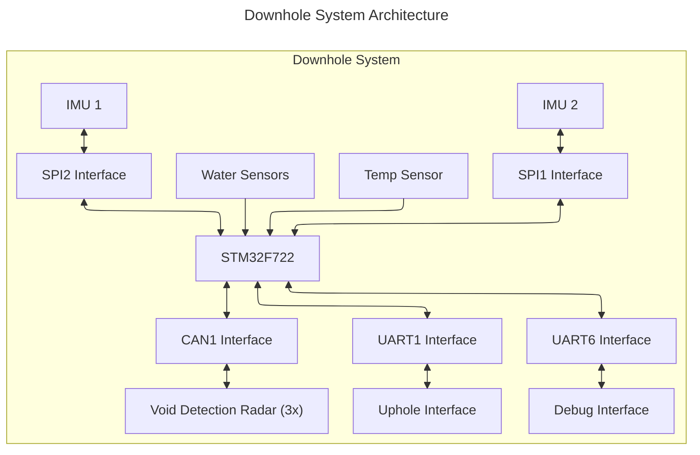
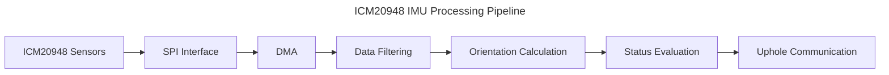
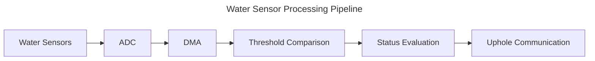
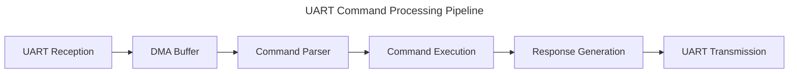

# System Architecture

This document provides an overview of the Downhole Commercial system architecture, including hardware interfaces, software modules, and data flow.

## Overview

The Downhole Commercial system is a sophisticated STM32F7-based sensor platform designed for challenging downhole environments. The system features a layered software architecture with comprehensive sensor management, real-time data processing, and robust communication capabilities. The implementation includes advanced motion detection algorithms, adaptive water sensing, temperature monitoring with alerting, and a complete void detection system with radar integration.

## Hardware Architecture

### Core Components

- **MCU**: STM32F722RET6 (ARM Cortex-M7, 216 MHz) with FPU and DSP instructions
- **Primary Sensors**:
  - Dual ICM20948 9-DOF IMU sensors (SPI1/SPI2) with self-test capabilities
  - Differential water detection via dual ADC channels with adaptive thresholding
  - High-precision temperature monitoring with configurable alert thresholds
  - Three radar sensors for void detection via CAN bus (120° separation)
- **Communication Interfaces**:
  - UART1 (Uphole): Primary data transmission (115200 baud)
  - UART6 (Debug): Development and diagnostic output (115200 baud)
  - UART3 (Void): Void detection system communication (115200 baud)
  - CAN1: Radar sensor control and data acquisition (125 kbps)
- **Storage & Processing**:
  - Flash memory with FIFO data logging system
  - Real-time sensor fusion and motion analysis
  - Configurable parameter storage and command interface

### Block Diagram



## Software Architecture

The software architecture implements a sophisticated layered design with comprehensive sensor management and real-time processing capabilities:

### Core System Modules

- **System Management** (`mti_system.c/h`): State machine-based system control with STATUS_INIT → STATUS_SYNC → STATUS_OK progression, module health tracking, and operation mode management
- **Command Processing** (`vmt_command.c/h`): Comprehensive command interface with 20+ command handlers, multi-channel UART routing, and parameter validation
- **UART Communication** (`vmt_uart.c/h`): Multi-channel communication with automatic channel switching, DMA-based transfers, and protocol handling
- **Device Control** (`vmt_device.c/h`): Hardware abstraction layer with peripheral initialization, power management, and device configuration

### Sensor Management Modules

- **IMU Management** (`mti_imu.c/h`, `vmt_icm20948.c/h`):
  - Dual ICM20948 sensor control with automatic failover
  - Advanced motion detection algorithms including bump detection, tilt monitoring, and idle state detection
  - Real-time sensor fusion with gyroscope drift compensation and accelerometer-based orientation calculation
  - Self-test capabilities and sensor validation
- **Water Detection** (`mti_water.c/h`, `vmt_adc.c/h`):
  - Adaptive threshold water detection using differential ADC measurements
  - Dynamic threshold adjustment based on contact conditions
  - Configurable sensitivity parameters and hysteresis control
- **Temperature Monitoring** (`mti_temp.c/h`):
  - High-precision temperature monitoring with smoothing algorithms
  - Configurable high/low threshold alerting system
  - Temperature validation and calibration support
- **Void Detection** (`mti_void.c/h`, `mti_radar.c/h`, `mti_can.c/h`):
  - Complete radar sensor management with staggered measurement cycles
  - Circle fitting algorithms for void geometry analysis
  - Multi-algorithm void detection (simple threshold and circle fitting)
  - CAN bus communication for radar sensor control and data acquisition

### Data Management

- **Flash Storage** (`vmt_flash.c/h`, `vmt_flash_fifo.c/h`): Flash memory operations and FIFO data structure
- **String Processing** (`vmt_string.c/h`): String handling utilities for command processing

## Software Layers

The system software is organized in a layered architecture:

1. **Hardware Abstraction Layer (HAL)**: STM32 HAL drivers
2. **Device Driver Layer**: Direct hardware interface (`vmt_*` files)
3. **Middleware Layer**: Data processing and algorithms (`mti_*` files)
4. **Application Layer**: Command processing, system control

## Control Flow

### Initialization Sequence

1. System hardware initialization (clocks, peripherals)
2. Device driver initialization
3. Sensor configuration
4. Communication interface setup
5. System state set to initialization complete

### Measurement Cycle

1. Timer-triggered sensor data acquisition
2. Data processing and filtering
3. Status evaluation (water detection, orientation)
4. Data logging (if enabled)
5. Status reporting to uphole interface

### Command Processing

1. UART interrupt/DMA receives command data
2. Command parser identifies command and parameters
3. Command handler executes the requested operation
4. Response generated and sent via appropriate interface

## Data Flow

### IMU Data Path



### Water Detection Data Path



### Command Data Path



## Key Design Considerations

### Redundancy

- Dual IMU sensors provide redundant motion detection
- Multiple communication interfaces ensure command and control options
- Data validation at multiple levels

### Power Management

- Low-power sleep mode during inactive periods
- Configurable sensor sampling rates
- Peripheral power control (e.g., IMU power via PB2)

### Data Integrity

- DMA-based data transfers minimize CPU load
- Error detection in communication protocols
- Flash storage with wear-leveling

### Real-time Performance

- Timer-synchronized sampling ensures consistent data acquisition
- Efficient interrupt handling for time-critical operations
- Optimized processing algorithms

## State Machine

The system operates according to the following state machine:

```ascii
    ┌───────────┐
    │           │
    │   Init    │
    │           │
    └─────┬─────┘
          │
          ▼
┌──────────────────┐     ┌──────────────┐
│                  │     │              │
│  Stopped State   │◄────┤  Sleep Mode  │
│                  │     │              │
└────────┬─────────┘     └──────┬───────┘
         │                      │
         │ @st                  │ @sleep
         ▼                      │
┌──────────────────┐            │
│                  │            │
│  Measure State   ├────────────┘
│                  │
└──────────────────┘
```

## Configuration Options

The system provides several configurable parameters:

- IMU sampling and filtering parameters
- Water detection thresholds and algorithm parameters
- Communication baud rates (fixed in firmware)
- Data logging parameters

## Memory Usage

- **Flash**: Program code and configuration storage
- **RAM**: Runtime data, DMA buffers, and processing workspace
- **Flash FIFO**: Structured data storage system for logging

## Implementation Constraints

- Real-time processing requirements (1kHz IMU sampling)
- Limited memory resources (RAM and flash)
- Power consumption limits

## Interface Standards

- UART communication: 8-N-1 format, variable baud rates
- SPI communication: Mode 3 (CPOL=1, CPHA=1), 4 MHz clock
- Command protocol: Text-based with `@` prefix, comma-separated parameters

## Development and Debugging

The system provides several debugging features:

- Debug UART interface (115200 bps)
- Command-based diagnostic functions
- Error reporting and status logging
