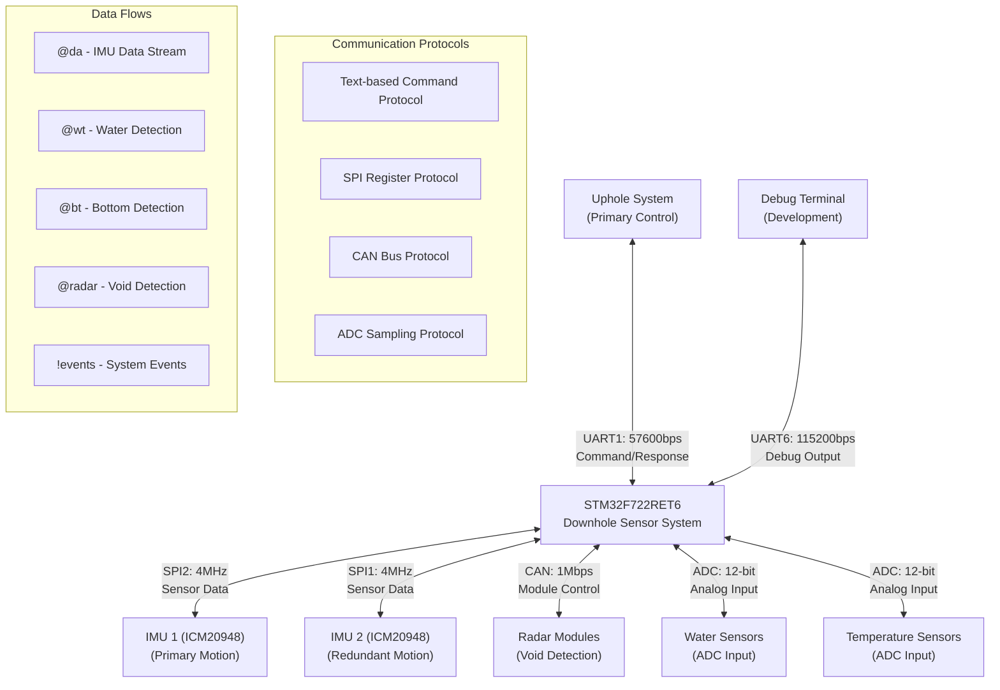

# Communication Protocols

## Overview

The STM32F722-based downhole sensor system implements a comprehensive multi-protocol communication architecture to interface between components and with external systems. The system supports:

- **Primary UART**: Uphole communication with command/response protocol
- **Secondary UART**: Debug output and diagnostic information  
- **Tertiary UART**: Reserved for radar module communication
- **Dual SPI**: High-speed communication with twin ICM20948 IMU sensors
- **CAN Bus**: Radar sensor integration and module communication
- **I2C**: Future sensor expansion capability

This document details the protocols used, their specifications, and implementation within the system based on the actual codebase analysis.

## UART Communication

The system implements multiple UART interfaces with channel-specific routing and processing:

### 1. Primary Communication (UART1 - Uphole)

The primary communication channel for uphole/downhole data exchange and system control.

**Hardware Configuration:**

- Instance: USART1  
- Pins: PB6 (TX), PB7 (RX)
- Baud rate: 57600 bps
- Word length: 8 bits
- Parity: None
- Stop bits: 1
- Flow control: None
- DMA: Enabled for both TX and RX with circular buffer management
- Features: TX/RX pin swap enabled for PCB routing optimization

**Communication Protocol:**

Commands from uphole follow a structured text format:

```text
@command,param1,param2,param3,...
```

Responses and data from downhole use various message types:

```text
@status,down,state_code,ver,major,minor,sub    # System status
!event_type,message_id,value                   # Event notifications
@da,timestamp:imu_data_stream                  # Sensor data stream
@wt,detection_state                            # Water detection
@bt,detection_state                            # Bottom detection
```

**Channel Routing:**

- Channel 0: Primary uphole communication
- Supports bi-directional command/response protocol
- Automatic keep-alive messaging during measurement operations
- Version information exchange on connection establishment

### 2. Debug Communication (UART6)

Dedicated channel for system diagnostics and development debugging.

**Hardware Configuration:**

- Instance: USART6
- Pins: PC6 (TX), PC7 (RX)  
- Baud rate: 115200 bps
- Word length: 8 bits
- Parity: None
- Stop bits: 1
- Flow control: None
- DMA: Enabled for RX with interrupt-driven processing

**Protocol Format:**

- Human-readable debug messages
- Configurable verbosity levels via debug flags
- System state and error reporting
- Performance monitoring and profiling data

**Channel Routing:**

- Channel 1: Debug output
- Supports printf-style formatted output
- Real-time system monitoring capabilities

### 3. Radar Communication (UART3)

Reserved communication channel for radar module integration.

**Hardware Configuration:**

- Instance: USART3
- Pins: PB10 (TX), PB11 (RX)
- Baud rate: 115200 bps  
- Word length: 8 bits
- Parity: None
- Stop bits: 1
- Flow control: None
- DMA: Enabled for both TX and RX

**Protocol Format:**

- Radar-specific command and data protocol
- Integration with CAN bus communication for radar modules
- Event-driven message processing

**Channel Routing:**

- Channel 2: Radar module communication
- Supports radar command abstraction layer
- Interfaces with CAN bus radar protocol

## SPI Communication

The system implements dual SPI interfaces for high-speed communication with twin ICM20948 IMU sensors, providing redundant motion sensing capability.

### SPI1 Interface (IMU2)

**Hardware Configuration:**

- Instance: SPI1
- Pins:
  - SCK: PB3 (Clock)
  - MISO: PB4 (Master In, Slave Out)
  - MOSI: PB5 (Master Out, Slave In)  
  - CS: PA15 (Chip Select - GPIO controlled)
- Mode: Master
- Data size: 8 bits
- Clock polarity: High (CPOL=1)
- Clock phase: 2nd edge (CPHA=1)
- Clock speed: 4 MHz (216 MHz / 54 prescaler)
- DMA: Full duplex with DMA2_Stream3 (TX) and DMA2_Stream0 (RX)

### SPI2 Interface (IMU1)

**Hardware Configuration:**

- Instance: SPI2
- Pins:
  - SCK: PB13 (Clock)
  - MISO: PB14 (Master In, Slave Out)
  - MOSI: PB15 (Master Out, Slave In)
  - CS: PB12 (Chip Select - GPIO controlled)
- Mode: Master
- Data size: 8 bits
- Clock polarity: High (CPOL=1)
- Clock phase: 2nd edge (CPHA=1)
- Clock speed: 4 MHz (108 MHz / 27 prescaler)
- DMA: Full duplex with DMA1_Stream4 (TX) and DMA1_Stream3 (RX)

### ICM20948 Communication Protocol

The ICM20948 IMU sensors use a register-based SPI protocol with bank switching:

**Register Access Format:**

1. **Read Operation:**
   - Assert CS low
   - Send register address (bit 7 = 0 for read)
   - Clock in data bytes
   - Deassert CS high

2. **Write Operation:**
   - Assert CS low  
   - Send register address (bit 7 = 1 for write)
   - Send data bytes
   - Deassert CS high

**Bank Selection Protocol:**

The ICM20948 has four register banks (0-3) accessed via bank switching:

1. Write to REG_BANK_SEL (0x7F)
2. Set bits [5:4] to select target bank
3. Access bank-specific registers
4. Switch banks as needed for different register sets

**Data Acquisition Sequence:**

1. Initialize sensor with configuration registers
2. Configure sample rates and filtering
3. Set up data ready interrupts
4. Read sensor data in response to interrupts:
   - Accelerometer: ACCEL_XOUT_H through ACCEL_ZOUT_L
   - Gyroscope: GYRO_XOUT_H through GYRO_ZOUT_L
   - Temperature: TEMP_OUT_H and TEMP_OUT_L

## Command Protocol

The command protocol is implemented in `vmt_command.c` and provides a comprehensive interface for system control, configuration, and data retrieval. The system supports over 20 distinct command handlers with channel-specific routing.

### Command Format

Commands follow a structured text format with comma-separated parameters:

```text
@command_name,parameter1,parameter2,parameter3,...
```

### Command Processing Architecture

1. **Reception**: Commands received via UART channels (primarily UART1)
2. **Parsing**: String tokenization extracts command name and parameters
3. **Routing**: Commands routed to appropriate handlers based on name matching
4. **Execution**: Handler functions process commands and generate responses
5. **Response**: Results transmitted back through designated UART channel

### Command Categories

**System Control Commands:**

- `reset` - System reset and initialization
- `sleep` - Enter low-power sleep mode  
- `wake` - Wake from sleep mode
- `status` - System status and state reporting
- `ver` - Firmware version information

**Configuration Commands:**

- `set,param,value` - Parameter configuration
- `get,param` - Parameter retrieval
- `save` - Save configuration to flash memory
- `load` - Load configuration from flash memory

**Sensor Control Commands:**

- `start` - Begin sensor data acquisition
- `stop` - Halt sensor data acquisition
- `cal` - Sensor calibration procedures
- `test` - Sensor self-test routines

**Data Commands:**

- `data` - Request sensor data transmission
- `log` - Data logging control
- `dump` - Memory dump operations
- `clear` - Clear data buffers

**Debug Commands:**

- `debug,level` - Set debug verbosity level
- `trace` - System trace control
- `mem` - Memory usage reporting
- `perf` - Performance monitoring

### Response Format

The system generates various response types:

**Status Responses:**

```text
@status,down,state_code,ver,major,minor,sub
```

**Event Notifications:**

```text
!event_type,message_id,event_value
```

**Data Streams:**

```text
@da,timestamp:sensor_data_fields
@wt,water_detection_state
@bt,bottom_detection_state
```

**Acknowledgments:**

```text
@ack,command_name,status
@nak,command_name,error_code
```

### Version Information Protocol

Since firmware v1.2.2, the system automatically sends version information on connection:

```text
@status,down,1,ver,0,9,2
```

Format: `@status,down,state,ver,major,minor,sub`

- state: System state code (1 = operational)
- major: Major version number
- minor: Minor version number  
- sub: Sub-version/patch number

### Keep-Alive Mechanism

Since firmware v0.8.3, the system implements automatic keep-alive messaging:

- Triggered during measurement state operations
- Sent if no communication occurs within 1-second timeout
- Maintains connection integrity with uphole system
- Format: Periodic status or heartbeat messages

## CAN Communication

The system includes CAN bus communication for radar sensor integration and future module expansion. CAN support is conditionally compiled based on `PCB_CANBUS` and `SENSOR_RADAR` definitions.

### Hardware Configuration

**CAN Controller:**

- Instance: CAN1
- Pins:
  - CAN_TX: PA12 (Transmit)
  - CAN_RX: PA11 (Receive)
- Mode: Normal operation
- Bit Timing Configuration:
  - Prescaler: 4 (based on 216 MHz system clock)
  - Time Segment 1: 5 time quanta
  - Time Segment 2: 2 time quanta  
  - Synchronization Jump Width: 1 time quantum
- Resulting bit rate: 1 Mbps
- Filter: Configured for radar module message acceptance

### CAN Message Protocol

**Standard Message Format:**

The system uses 11-bit standard CAN identifiers with 8-byte data payloads:

| CAN ID Range | Direction  | Purpose             |
|--------------|------------|---------------------|
| 0x100-0x1FF  | TX → Radar | Command messages    |
| 0x200-0x2FF  | RX ← Radar | Status responses    |
| 0x300-0x3FF  | RX ← Radar | Sensor data         |
| 0x400-0x4FF  | RX ← Radar | Event notifications |

### Radar Module Integration

**Command Interface:**

Radar control is abstracted through the standard UART command protocol:

```text
@radar,cmd,parameters    # Generic radar command
@radar,status           # Request radar status
@radar,start            # Begin radar measurement
@radar,stop             # Stop radar measurement  
@radar,power,level      # Set power level (0-7)
@radar,cal              # Calibrate radar sensor
```

**Data Format:**

Radar sensor data is processed and transmitted via UART:

```text
@radar,dist,value,quality    # Distance measurement with quality indicator
@radar,event,type,data       # Radar event notification
@radar,status,state          # Radar operational status
```

**Staggered Operation:**

The radar system implements staggered operation for multiple radar modules:

- Round-robin scheduling prevents interference
- Configurable measurement intervals
- Individual module power management
- Synchronized data collection timing

### Error Handling and Recovery

**CAN Error Management:**

1. **Bus-off Recovery**: Automatic recovery from bus-off conditions
2. **Error Counter Monitoring**: Real-time monitoring of transmit/receive error counters
3. **Message Timeout**: Detection of unresponsive radar modules
4. **Automatic Retransmission**: Failed message retry mechanism
5. **Filter Reconfiguration**: Dynamic filter adjustment for module discovery

## IMU Communication Protocol

The system interfaces with dual ICM20948 IMU sensors through dedicated SPI channels, implementing advanced motion detection and sensor fusion algorithms.

### Register Access Protocol

**Read Operation Sequence:**

1. Assert chip select (CS) low
2. Transmit register address with MSB = 0 (read bit)
3. Clock in data bytes from sensor
4. Deassert chip select (CS) high

**Write Operation Sequence:**

1. Assert chip select (CS) low
2. Transmit register address with MSB = 1 (write bit)
3. Transmit data bytes to sensor
4. Deassert chip select (CS) high

### Bank Selection Protocol

The ICM20948 implements a four-bank register architecture requiring bank switching:

1. **Bank Selection**: Write to REG_BANK_SEL (0x7F)
2. **Bank Encoding**: Set bits [5:4] to select bank (0-3)
3. **Register Access**: Access bank-specific registers
4. **Bank Management**: Automatic bank switching handled by driver layer

### Sensor Configuration Sequence

**Initialization Process:**

1. **Power Management**: Configure power management registers
2. **Clock Source**: Set internal oscillator as clock source
3. **Sample Rate**: Configure gyroscope and accelerometer sample rate dividers
4. **Range Configuration**: Set measurement ranges for gyroscope and accelerometer
5. **Filter Configuration**: Enable low-pass filtering for noise reduction
6. **Interrupt Setup**: Configure data ready interrupts
7. **Calibration**: Perform initial sensor calibration

**Data Acquisition Protocol:**

1. **Interrupt Trigger**: Data ready interrupt signals new data availability
2. **Multi-byte Read**: Burst read accelerometer and gyroscope data
3. **Data Processing**: Apply calibration and filtering algorithms
4. **Sensor Fusion**: Combine accelerometer and gyroscope data for orientation
5. **Motion Detection**: Process data through motion detection algorithms

## Data Communication Formats

### IMU Data Transmission

Processed IMU data is transmitted in structured format:

```text
@da,timestamp:imu1_ax:imu1_ay:imu1_az:imu1_angle_acc:imu1_angle_gyro:imu2_ax:imu2_ay:imu2_az:imu2_angle_acc:imu2_angle_gyro
```

**Field Descriptions:**

- `timestamp`: System timestamp in milliseconds
- `imu1_ax, imu1_ay, imu1_az`: IMU1 accelerometer readings (raw counts)
- `imu1_angle_acc`: IMU1 angle from accelerometer (degrees)
- `imu1_angle_gyro`: IMU1 angle from gyroscope integration (degrees)
- `imu2_*`: Corresponding IMU2 measurements

**Example:**

```text
@da,1000:120:-340:16400:45:47:118:-338:16405:44:46
```

### Sensor Event Notifications

**Water Detection Events:**

```text
@wt,detection_state
```

- `detection_state`: 1 for water detected, 0 for no water

**Bottom Detection Events:**

```text
@bt,detection_state  
```

- `detection_state`: 1 for bottom detected, 0 for no bottom detected

**Motion Events:**

```text
!motion,event_id,value
```

- Motion detection, bumps, tilts, and idle state notifications

**Temperature Events:**

```text
!temp,sensor_id,temperature_value
```

- Temperature threshold alerts and monitoring data

### Advanced Data Streams

**Void Detection Data:**

```text
@void,status,confidence,distance,quality
```

- Real-time void detection results with confidence metrics

**Radar Integration Data:**

```text
@radar,module_id,distance,signal_strength,detection_quality
```

- Multi-module radar sensor data with quality indicators

**System Diagnostics:**

```text
@diag,module,status,error_code,additional_data
```

- Comprehensive system health and diagnostic information

## Power Management and Wake-up Protocol

The system implements sophisticated power management to extend battery life during downhole operations.

### Sleep Mode Operation

**Sleep Preparation Sequence:**

1. **Stop Active Operations**: Halt ADC conversions and SPI DMA transfers
2. **Configure Wake Sources**: Set UART RX pins as external interrupt triggers
3. **Save State**: Store critical system state to non-volatile memory
4. **Enter STOP Mode**: Activate low-power mode with main regulator off
5. **Wake Detection**: Monitor for UART activity or system events

**Wake-up Protocol:**

1. **Interrupt Handling**: Process wake-up interrupt from UART activity
2. **System Restoration**: Restore peripheral configurations and clock settings
3. **State Recovery**: Reload saved system state and resume operations
4. **Wake Notification**: Send wake notification to uphole system

```text
@wake
```

### Low-Power Communication

**Optimized Communication During Sleep:**

- UART RX lines configured as wake-up sources
- Minimal power consumption in STOP mode
- Fast wake-up response (< 10ms typical)
- Automatic system state restoration
- Seamless communication resumption

## Communication Architecture Diagram

The following diagram illustrates the comprehensive communication architecture:



### Communication Summary

**Primary Interfaces:**

- **UART1**: 57600 bps primary uphole communication
- **UART6**: 115200 bps debug and diagnostic output
- **SPI1/SPI2**: 4 MHz dual IMU sensor interfaces
- **CAN1**: 1 Mbps radar module communication
- **ADC**: 12-bit analog sensor inputs

**Protocol Stack:**

- **Application Layer**: Text-based command protocol
- **Transport Layer**: UART/SPI/CAN hardware protocols
- **Physical Layer**: RS-232, SPI, CAN bus electrical standards

**Data Types:**

- **Commands**: Bi-directional control and configuration
- **Sensor Data**: High-frequency IMU and sensor streams
- **Events**: Asynchronous system and detection notifications
- **Status**: System health and operational state information
