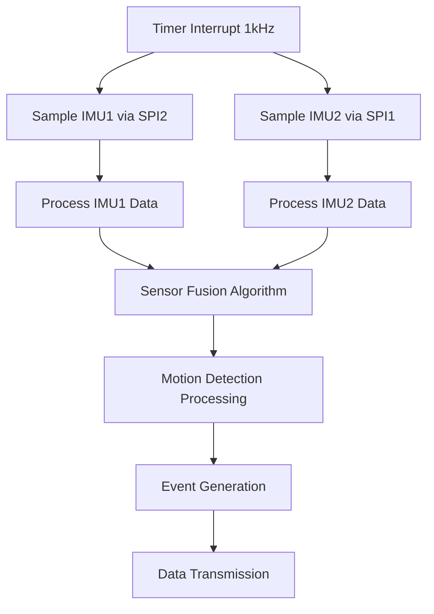
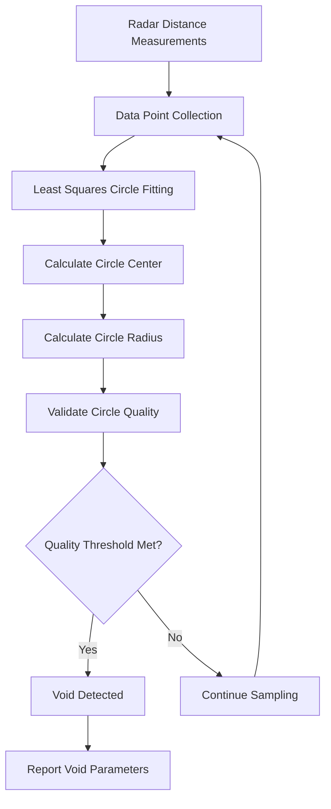
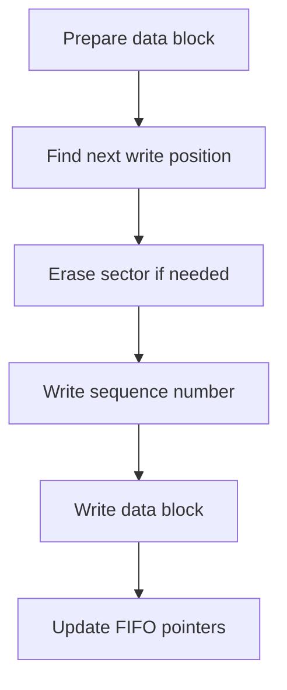
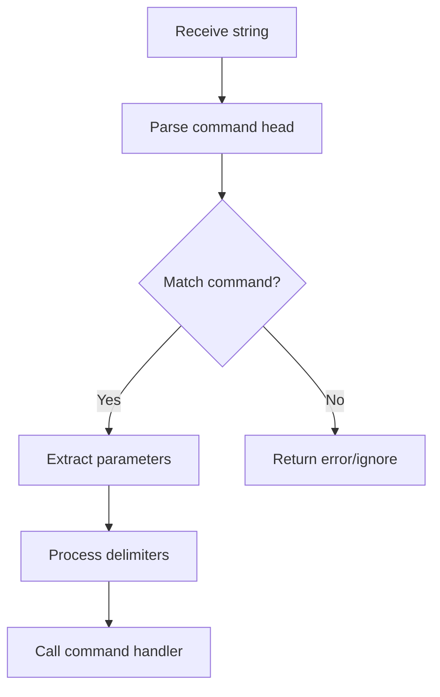
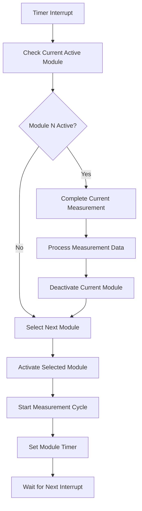
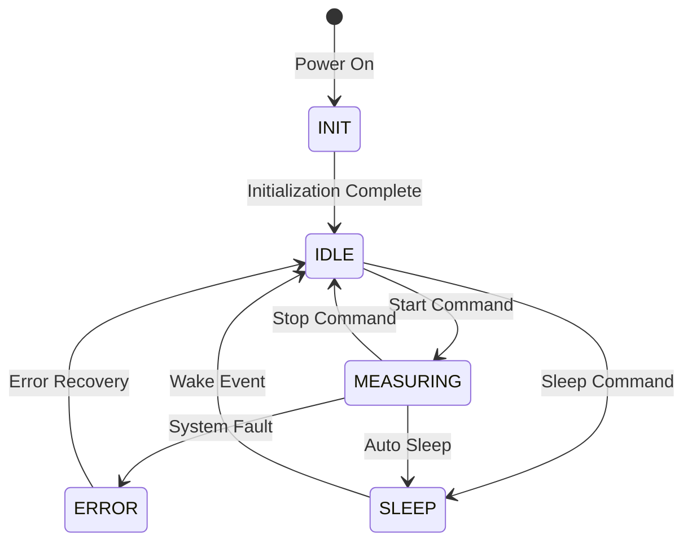

# Core Algorithms

This document describes the key algorithms implemented in the STM32F722-based downhole sensor system, focusing on advanced sensor data processing, detection mechanisms, data fusion, and system management based on comprehensive codebase analysis.

## Motion Detection and IMU Processing

### Advanced Motion Detection Algorithm

The system implements sophisticated motion detection algorithms in `mti_imu.c` with multiple detection modes:

**Bump Detection Algorithm:**

```c
// Simplified representation of bump detection logic
if (accel_magnitude > bump_threshold_high) {
    if (!bump_detected) {
        bump_detected = true;
        bump_start_time = current_time;
        trigger_bump_event();
    }
} else if (accel_magnitude < bump_threshold_low) {
    if (bump_detected && (current_time - bump_start_time > min_bump_duration)) {
        bump_detected = false;
        trigger_bump_end_event();
    }
}
```

**Tilt Detection Algorithm:**

- Continuous monitoring of device orientation using dual IMU sensors
- Adaptive threshold adjustment based on environmental conditions
- Hysteresis implementation to prevent oscillation near detection boundaries
- Real-time angle calculation from accelerometer and gyroscope fusion

**Idle State Detection:**

- Low-motion detection algorithm for power management optimization
- Configurable threshold for determining idle vs. active states
- Integration with system power management for automatic sleep/wake cycles

### Dual IMU Sensor Fusion

The system implements redundant IMU processing with sophisticated sensor fusion:

**Synchronous Sampling:**



**Gyroscope Drift Compensation:**

- Real-time bias estimation and correction
- Temperature-compensated drift models
- Cross-sensor validation for improved accuracy
- Adaptive filtering based on motion state

**Self-Test and Calibration:**

- Automated sensor health monitoring
- Periodic self-test execution during idle periods
- Dynamic calibration adjustment based on sensor performance
- Error detection and failover to backup sensor

## Water Detection Algorithm

### Overview

The water detection system uses dual redundant sensors (ADC_WATER1 and ADC_WATER2) to reliably detect the presence of water. The algorithm implements an adaptive threshold mechanism with hysteresis to prevent oscillation near the detection boundaries.

### Sensor Configuration

- Two independent water sensors connected to ADC2 channels:
  - Water Sensor 1: ADC2_IN9 (PB1)
  - Water Sensor 2: ADC2_IN6 (PA6)
- ADC Sample Rate: 400 Hz (triggered by TIM4)
- Sample Averaging: Moving average over 40 samples
- Resolution: 12-bit (0-4095 range)

### Threshold System

The water detection algorithm uses four key parameters to implement its adaptive threshold system:

1. **Base Threshold**: The initial detection threshold value (default: configurable, typically 1280)
2. **Reserve Value**: A safety margin added to the threshold (configurable via `@cmd,reserve`)
3. **Multiplier**: Value that defines relationship between high and low thresholds (configurable via `@cmd,multiplier`)
4. **Air/Water Ratio**: Calibration values for different media (configurable via `@cmd,air` and `@cmd,water`)

```mermaid
flowchart TD
    A[Base Threshold] --> C[High Threshold]
    B[Reserve Value] --> C
    C --> D{Water Detected?}
    D -->|Yes| E[Adaptive Threshold Adjustment]
    E --> F[New High Threshold = max(current threshold, new reading)]
    F --> G[Low Threshold Calculation]
    H[Multiplier] --> G
    G --> I[Low Threshold = High Threshold / Multiplier]
```

### Complete Detection Algorithm

```c
void water_detection_process(uint16_t water_adc1, uint16_t water_adc2) {
    // Select maximum reading between two sensors
    uint16_t water_reading = (water_adc1 > water_adc2) ? water_adc1 : water_adc2;
    
    // Apply moving average filter
    moving_avg_u16_update(&water_avg, water_reading);
    
    // Detection logic with hysteresis
    if (water_avg.avg > high_threshold) {
        if (!water_detected) {
            water_detected = true;
            send_water_detection_event(1);
        }
        
        // Adaptive threshold: if reading exceeds current threshold, adjust upward
        if (water_avg.avg > high_threshold) {
            high_threshold = water_avg.avg;
            low_threshold = high_threshold / water_multiplier;
        }
    } 
    else if (water_avg.avg < low_threshold) {
        if (water_detected) {
            water_detected = false;
            send_water_detection_event(0);
        }
    }
}
```

### Water Detection Calibration Procedure

The system provides commands for calibrating the water detection thresholds:

1. **Environmental Calibration**:
   - Use `@cmd,air,value` to set the ratio for air readings
   - Use `@cmd,water,value` to set the ratio for water readings
   - These values adjust the detection sensitivity based on environmental conditions

2. **Threshold Calibration**:
   - Use `@sensor,w` to read current water sensor values
   - Use `@sensor,w,value` to set a specific threshold value
   - The system will then add the reserve margin to establish the high threshold

3. **Fine Tuning**:
   - Use `@cmd,reserve,value` to adjust the safety margin
   - Use `@cmd,multiplier,value` to adjust the hysteresis behavior

4. **Monitoring**:
   - Use `@cmd,adc` to toggle real-time ADC value printing
   - This allows verification of sensor readings in different conditions

### Threshold Calculation Formula

```bash
High Threshold = Base Threshold + Reserve Value
Low Threshold = High Threshold / Multiplier
```

Where:

- Base Threshold: Set via `@sensor,w,value` command
- Reserve Value: Set via `@cmd,reserve,value` command
- Multiplier: Set via `@cmd,multiplier,value` command (default: 1.2)

## Temperature Monitoring System

### High-Precision Temperature Algorithm

The temperature monitoring system in `mti_temp.c` implements advanced algorithms for precise temperature measurement and threshold management:

**Multi-Sensor Temperature Processing:**

- Support for up to 8 temperature sensors via ADC channels
- Individual calibration coefficients for each sensor
- Real-time temperature conversion with polynomial correction
- Configurable alert thresholds with hysteresis

**Temperature Calculation Algorithm:**

```c
// Simplified temperature conversion with calibration
float calculate_temperature(uint16_t adc_value, uint8_t sensor_id) {
    float voltage = (adc_value * VREF) / 4096.0f;
    float temp_raw = (voltage - cal_offset[sensor_id]) / cal_slope[sensor_id];
    return temp_raw + temperature_compensation(sensor_id);
}
```

**Smoothing and Filtering:**

- 40-sample moving average for noise reduction
- Outlier detection and rejection algorithms
- Temperature rate-of-change limiting for stability
- Configurable sampling and update rates

## Void Detection Algorithm

### Advanced Circle Fitting Algorithm

The void detection system in `mti_void.c` implements sophisticated geometric algorithms for detecting cylindrical voids:

**Circle Fitting Implementation:**



**Multi-Algorithm Detection Approach:**

- Least squares circle fitting for geometric analysis
- Statistical clustering for data point validation
- Confidence scoring based on measurement consistency
- Real-time algorithm switching based on data quality

**Radar Integration and Processing:**

- Staggered measurement scheduling across multiple radar modules
- CAN bus communication for radar control and data acquisition
- Distance measurement validation and filtering
- Multi-sensor data fusion for improved accuracy

### Circle Fitting Mathematics

The system implements the mathematical circle fitting algorithm:

**Least Squares Method:**

1. Collect distance measurements from multiple angles
2. Convert polar coordinates to Cartesian coordinates
3. Apply least squares fitting algorithm:

    ```matlab
    Minimize: Σ(r_i - r_fitted)²
    Where: r_fitted = √((x_i - center_x)² + (y_i - center_y)²)
    ```

4. Calculate circle parameters (center_x, center_y, radius)
5. Compute fitting quality metrics (R², standard deviation)

**Quality Assessment:**

- Measurement consistency across multiple radar modules
- Circle fit residual analysis for detection confidence
- Statistical validation of geometric parameters
- Temporal filtering for reducing false positives

## Flash FIFO Implementation

The system implements a custom FIFO structure in flash memory to handle data logging:

### Flash FIFO Structure

```ascii
+-------------------+
| Header Section    |
+-------------------+
| Sequence Number 1 |
| Data Block 1      |
+-------------------+
| Sequence Number 2 |
| Data Block 2      |
+-------------------+
| ...               |
+-------------------+
| Sequence Number N |
| Data Block N      |
+-------------------+
```

### Data Write Algorithm

The flash FIFO algorithm implements a circular buffer in flash memory with wear-leveling considerations:



This algorithm includes special handling for:

- Flash sector boundaries
- Sequence number wrapping
- Error recovery for interrupted writes
- Wear leveling across flash sectors

## String Processing Algorithms

### Command Parsing

The command parsing algorithm handles the string-based command protocol:



### Hexadecimal String Conversion

The system implements efficient algorithms for converting hexadecimal string representations to binary data:

```c
void atox_n(const char *p_str, void *p_data, size_t size) {
    memset(p_data, 0x0, size);

    size_t str_hex_len;
    char *p_str_hex = str_find_hex(p_str, &str_hex_len);

    uint8_t data_u4 = 0x0;
    uint8_t *p_data_u8 = p_data;
    size_t data_u8_n = 0;
    bool b_data_h = true;
    char ascii;
    for (size_t hex_char_n = 0; hex_char_n < str_hex_len; hex_char_n++) {
        ascii = p_str_hex[hex_char_n];
        if ((ascii >= '0') && (ascii <= '9')) {
            data_u4 = ascii - '0' + 0x0;
        } else if ((ascii >= 'a') && (ascii <= 'f')) {
            data_u4 = ascii - 'a' + 0xA;
        } else if ((ascii >= 'A') && (ascii <= 'F')) {
            data_u4 = ascii - 'A' + 0xA;
        } else {
            break;
        }

        if (b_data_h) {
            p_data_u8[data_u8_n] = data_u4 << 4;
        } else {
            p_data_u8[data_u8_n] |= data_u4;
            data_u8_n++;
        }
        b_data_h ^= true;
        if (data_u8_n >= size)
            break;
    }
}
```

## Radar Management System

### Staggered Radar Operation Algorithm

The radar management system in `mti_radar.c` implements sophisticated staggered operation to prevent interference between multiple radar modules:

**Round-Robin Scheduling:**



**Staggered Timing Algorithm:**

- Configurable measurement intervals per module (typically 50-200ms)
- Inter-module delay to prevent interference (typically 10-50ms)
- Dynamic scheduling based on module availability and priority
- Power management integration for individual module control

**CAN Bus Integration:**

- Module identification and enumeration via CAN bus scanning
- Command/response protocol for radar control
- Real-time status monitoring and error detection
- Data collection and synchronization across multiple modules

### Multi-Module Data Fusion

**Data Collection and Validation:**

- Simultaneous data collection from multiple radar modules
- Timestamp synchronization for temporal correlation
- Distance measurement validation and outlier rejection
- Quality scoring based on signal strength and consistency

**Geometric Analysis:**

- Angular position calculation based on module placement
- 3D coordinate transformation for spatial mapping
- Multi-perspective void detection algorithm
- Confidence weighting based on measurement geometry

## Advanced System Algorithms

### State Machine Management

The system implements a comprehensive state machine in `mti_system.c` for robust system control:

**System States:**



**State Transition Logic:**

- Event-driven state transitions with validation
- Timeout handling for stuck states
- Error recovery mechanisms with automatic retry
- Power management integration with state-dependent behavior

### Command Processing Algorithm

**Multi-Channel Command Router:**

```c
// Simplified command routing logic
typedef struct {
    char* command_name;
    uint8_t channel_mask;  // Bitmap of allowed channels
    command_handler_t handler;
} command_entry_t;

void process_command(char* cmd_string, uint8_t channel) {
    for (int i = 0; i < num_commands; i++) {
        if (strcmp(cmd_string, commands[i].command_name) == 0) {
            if (commands[i].channel_mask & (1 << channel)) {
                commands[i].handler(cmd_string, channel);
                return;
            }
        }
    }
    send_error_response(channel, "Unknown command");
}
```

**Feature Set:**

- 20+ command handlers with parameter validation
- Channel-specific routing and permissions
- Parameter parsing with type checking
- Response formatting and error handling
- Command history and logging capability

### Data Logging and Storage

**Flash-Based Data Logging:**

- Circular buffer implementation in flash memory
- Wear leveling across multiple flash sectors
- Data integrity protection with checksums
- Power-loss recovery with sector validation

**Data Structure Optimization:**

- Compressed data formats for efficient storage
- Variable-length encoding for sensor data
- Timestamp compression with delta encoding
- Metadata indexing for fast data retrieval

## System Performance Optimization

### Interrupt Management

**Priority-Based Interrupt Handling:**

- High-priority: Safety-critical sensor interrupts
- Medium-priority: Communication and timing interrupts  
- Low-priority: Background processing and housekeeping
- Nested interrupt support with critical section protection

### Memory Management

**Dynamic Buffer Management:**

- Circular buffers for sensor data streams
- Memory pool allocation for temporary data
- Stack overflow protection and monitoring
- Heap fragmentation prevention strategies

**DMA Optimization:**

- Continuous DMA for sensor data acquisition
- Double-buffering for real-time processing
- DMA completion callbacks for efficient processing
- Error handling and recovery for DMA failures
