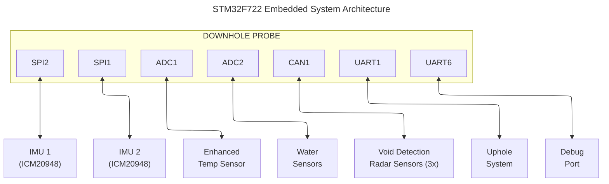

# Hardware Interfaces

This document details the hardware interfaces and pin configurations in the STM32F722RET6-based downhole sensor system, based on comprehensive analysis of the actual hardware definitions in `main.h` and system implementation.

## Microcontroller Specifications

The system is built around the STM32F722RET6 microcontroller:

- **Core**: ARM Cortex-M7 with FPU and cache
- **Clock Speed**: 216 MHz system clock (108 MHz APB1, 216 MHz APB2)
- **Memory**: 512 KB Flash, 256 KB SRAM
- **Package**: LQFP64
- **Operating Voltage**: 1.8V to 3.6V
- **Temperature Range**: -40°C to +85°C (industrial grade)

## Primary Sensor Interfaces

### Dual IMU Configuration (ICM20948)

The system implements redundant IMU sensing with two ICM20948 9-axis motion sensors for enhanced reliability and accuracy.

#### IMU1 Interface (SPI2)

| Signal | MCU Pin | Function    | Description              |
|--------|---------|-------------|--------------------------|
| SCLK   | PB13    | SPI2_SCK    | Serial Clock (4 MHz)     |
| MISO   | PB14    | SPI2_MISO   | Master In Slave Out      |
| MOSI   | PB15    | SPI2_MOSI   | Master Out Slave In      |
| CS     | PB12    | GPIO Output | Chip Select (Active Low) |
| INT    | PB0     | EXTI0       | Data Ready Interrupt     |

#### IMU2 Interface (SPI1)

| Signal | MCU Pin | Function    | Description              |
|--------|---------|-------------|--------------------------|
| SCLK   | PB3     | SPI1_SCK    | Serial Clock (4 MHz)     |
| MISO   | PB4     | SPI1_MISO   | Master In Slave Out      |
| MOSI   | PB5     | SPI1_MOSI   | Master Out Slave In      |
| CS     | PA15    | GPIO Output | Chip Select (Active Low) |
| INT    | PD2     | EXTI2       | Interrupt from IMU2      |

#### IMU Configuration Details

- **Sample Rate**: 1000 Hz for both IMUs
- **SPI Mode**: Mode 3 (CPOL=1, CPHA=1)
- **Communication**: Full-duplex SPI with DMA support
- **Data Processing**:
  - Synchronized sampling via TIM7 (1 kHz)
  - Configurable low-pass filtering
  - Averaging over configurable timespan (default 200ms)

#### IMU Power Control

| Signal  | MCU Pin | Function    | Description                 |
|---------|---------|-------------|-----------------------------|
| PWR_IMU | PB2     | GPIO Output | Power control for both IMUs |

### ADC Sensors

The system includes temperature and water detection sensors connected via ADC inputs with DMA for continuous sampling:

#### Temperature Sensor Interface

| Signal   | MCU Pin | Function | Description                     |
|----------|---------|----------|---------------------------------|
| ADC_TEMP | PA5     | ADC1_IN5 | Temperature sensor analog input |

#### Water Detection Sensor Interface

| Signal     | MCU Pin | Function | Description                 |
|------------|---------|----------|-----------------------------|
| ADC_WATER1 | PB1     | ADC2_IN9 | Water sensor 1 analog input |
| ADC_WATER2 | PA6     | ADC2_IN6 | Water sensor 2 analog input |

#### ADC Configuration Details

- **ADC Clock**: TIM2/TIM4 triggered sampling
- **Sample Rate**: 400 Hz
- **Resolution**: 12-bit
- **Transfer**: DMA in circular mode for continuous sampling
- **Sampling Time**: 480 cycles for water sensors, 3 cycles for temperature sensor

## Communication Interfaces

### Uphole Communication Interface (UART1)

| Signal        | MCU Pin       | Function          | Description                        |
|---------------|---------------|-------------------|------------------------------------|
| UPHOLE_TXD    | PB6           | USART1_TX         | Data transmission to uphole system |
| UPHOLE_RXD    | PB7           | USART1_RX         | Data reception from uphole system  |
| **Baud Rate** | **57600 bps** | **Configuration** | **8N1, with Rx/Tx swap**           |

### Debug Interface (UART6)

| Signal        | MCU Pin        | Function          | Description             |
|---------------|----------------|-------------------|-------------------------|
| DEBUG_TXD     | PC6            | USART6_TX         | Debug data transmission |
| DEBUG_RXD     | PC7            | USART6_RX         | Debug data reception    |
| **Baud Rate** | **115200 bps** | **Configuration** | **8N1**                 |

### Void Detection Interface (UART3)

| Signal        | MCU Pin        | Function          | Description                      |
|---------------|----------------|-------------------|----------------------------------|
| VOID_TXD      | PB10           | USART3_TX         | Void detection data transmission |
| VOID_RXD      | PB11           | USART3_RX         | Void detection data reception    |
| **Baud Rate** | **115200 bps** | **Configuration** | **8N1**                          |

### CAN Interface

For radar module communication:

| Signal | MCU Pin | Function | Description          |
|--------|---------|----------|----------------------|
| CAN_TX | PA12*   | CAN1_TX  | CAN bus transmission |
| CAN_RX | PA11*   | CAN1_RX  | CAN bus reception    |

\* Pins available in alternative configuration

## Clock System

The clock system is configured as follows:

- **External Crystal**: 8 MHz HSE (High-Speed External)
- **PLL Configuration**:
  - Input: 8 MHz HSE ÷ 4 (PLLM) = 2 MHz VCO input
  - Multiplier: × 96 (PLLN) = 192 MHz VCO output
  - System Clock Divider: ÷ 6 (PLLP) = 32 MHz
- **System Clock (SYSCLK)**: 32 MHz (PLL output)
- **AHB Clock (HCLK)**: 16 MHz (SYSCLK ÷ 2)
- **APB1 Clock (PCLK1)**: 16 MHz (HCLK ÷ 1)
- **APB2 Clock (PCLK2)**: 16 MHz (HCLK ÷ 1)
- **Voltage Scaling**: Scale 3 (1.0V typical) for power optimization

## Timer Configuration

The system uses several timers for coordinated operations:

| Timer | Function       | Configuration | Purpose                          |
|-------|----------------|---------------|----------------------------------|
| TIM2  | ADC1 Trigger   | 40kHz         | Temperature sensor sampling      |
| TIM4  | ADC2 Trigger   | 400Hz         | Water sensor sampling            |
| TIM5  | General timing | 400Hz         | System timing reference          |
| TIM7  | IMU Sampling   | 1kHz          | Coordinated IMU data acquisition |

## Flash Memory Organization

The internal flash memory is organized as follows:

- **Boot Code**: 0x08000000 - 0x0800FFFF (64 KB)
- **Application**: 0x08010000 - 0x0807FFFF (448 KB)
- **Data Storage**: Organized using a FIFO structure for logging events

## Power Requirements

The system operates from the following power supplies:

- **Main Supply Voltage**: 3.3V
- **I/O Voltage**: 3.3V
- **Current Consumption**:
  - Active mode: Approximately 90mA
  - Sleep mode: Approximately 5mA

## Physical Interfaces

### Connector Pinout

| Pin | Signal    | Description             |
|-----|-----------|-------------------------|
| 1   | VDD       | 3.3V Power              |
| 2   | GND       | Ground                  |
| 3   | UPHOLE_TX | Uphole Communication TX |
| 4   | UPHOLE_RX | Uphole Communication RX |
| 5   | DEBUG_TX  | Debug TX                |
| 6   | DEBUG_RX  | Debug RX                |
| 7   | VOID_TX   | Void Detection TX       |
| 8   | VOID_RX   | Void Detection RX       |

## Hardware Layout Considerations

### Power Routing

- Power connections for the IMU sensors should be routed with sufficient width to handle current demands
- Separate analog and digital ground planes connected at a single point
- Place decoupling capacitors (0.1μF) close to sensor power pins
- Common power control for both IMUs via PB2 for synchronized power management

### Signal Integrity

- Keep SPI traces short and equal length when possible
- Route differential pairs with controlled impedance
- Avoid routing sensitive analog signals near high-speed digital signals
- Use ground planes to isolate analog and digital sections

### Thermal Considerations

- IMU sensors and microcontroller thermal design considers operating environment
- Components rated for -20°C to +85°C operation
- Temperature sensor monitors system thermal conditions

## Functional Block Diagram

## Reference Documents

- STM32F722RET6 Datasheet
- ICM20948 Motion Sensor Datasheet
- Hardware Design Guidelines v1.2
- Temperature Sensor Datasheet
- Void Detection Radar Sensor Specification v1.0
- CAN Bus Interface Standard (ISO 11898)
